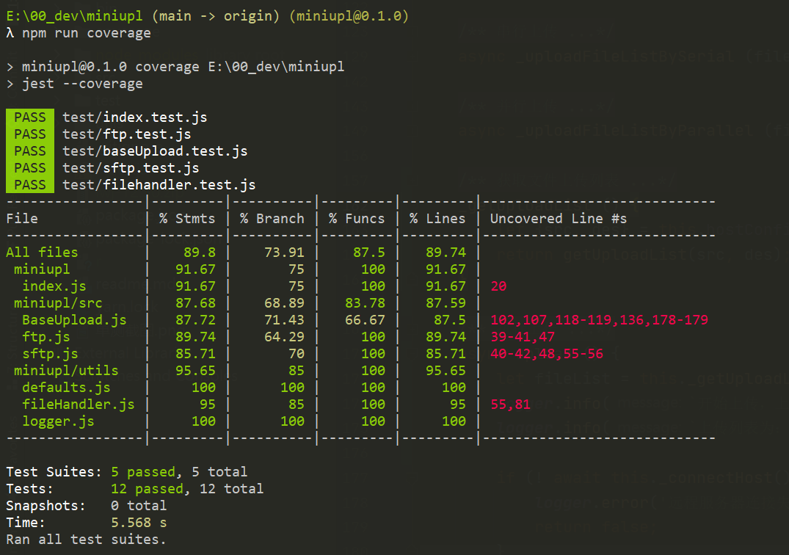

# 文件上传

## 实现一个文件上传的工具（在第三方库上做二次的封装，比如：ftp、ssh、samba），要求如下：
1. 支持文件、目录、glob上传方式
2. 支持 ftp、sftp 等常用的传输方式
3. 支持命令行、SDK等多种调用方式

## 使用方式

- 命令行调用

```bash

miniupl -h
# Usage: miniupl [options]
# Options:
#  -v, -V                       显示当前版本
#  --protocol <protocol>        使用的上传协议 (default: "sftp")
#  --ip <ip>                    远程服务器IP，必填
#  --port <port>                远程端口 (default: "22")
#  --usn --username <username>  用户名 (default: "")
#  --pwd --password <password>  登录密码 (default: "")
#  --src <src>                  源文件或目录的路径，必填 (default: "")
#  --des <des>                  目标路径，必填，只能输入一个 (default: "")
#  --byParallel <byParallel>    是否并行上传 (default: true)
#  -h, --help                   帮助文档

miniupl -v
# 0.1.0

# 使用 ftp 协议，并行上传（默认）
miniupl --protocol ftp --ip 127.0.0.1 --port 21 --src ./src --des /root/lwj

# 使用 sftp 协议（协议和端口为默认）, 串行上传
miniupl --ip 47.56.223.228 --usn root --pwd 2020@2020 --des --src ./src /root/lwj --byParallel false

```
- SDK调用

```js
import { MiniUpl, Ftp, Sftp } from 'miniupl';

let config = {
    ip: '127.0.0.1',
    port: 21,
    byParallel: true,
    src: './bin/*',
    des: '/root/lwj',
    protocol: 'ftp'
};


let miniupl = new MiniUpl(config);
miniupl.upload();

const ftpUpl = new Ftp(config);
ftpUpl.upload();

let sftpConfg = {
    ip: '47.56.223.228',
    port: 22,
    username: 'root',
    password: '2020@host',
    byParallel: true,
    src: './bin/*',
    des: '/root/lwj',
    protocol: 'sftp'
};

const sftpUpl = new Sftp(sftpConfg);
sftpUpl.upload();
```

- 事件监听

```js

// 连接服务器：startConnect、connectSuccess、connectFailed、disconnect
// 开始连接
miniupl.on('startConnect', () => {});

// 连接成功
miniupl.on('connectSuccess', () => {});

// 连接失败
miniupl.on('connectFailed', (e) => {
    console.log(e);
});

// 连接断开
miniupl.on('disconnect', () => {});

// 连接断开
miniupl.on('disconnect', () => {});

// 文件上传
// 上传开始
miniupl.on('uploadStart', (fileList) => {});

// 全部上传完成
miniupl.on('uploadFinish', (fileList) => {});

// 单文件上开始
miniupl.on('singleFileStart', (uploadingFile) => {});

// 单文件上传成功
miniupl.on('singleFileSuccess', (uploadingFile) => {});

// 单文件上传失败
miniupl.on('singleFileFaile', (err, uploadingFile) => {});

```

## 单元测试

```bash
npm run test
# or
npm run coverage

```
- 单元测试覆盖率

